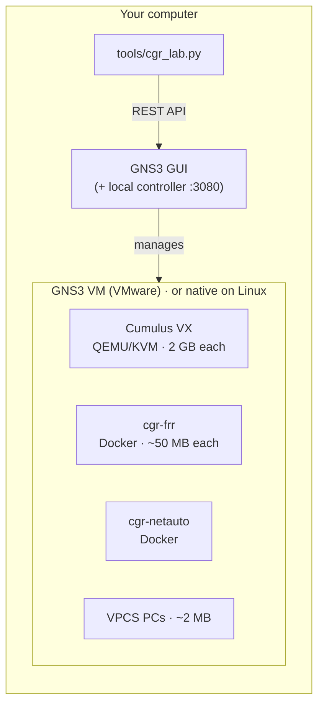

# How the lab environment works

* **GNS3 GUI** draws the topology and opens consoles. It talks to a small local *controller*.
* **GNS3 VM** (Windows/macOS) is where the devices actually run. On Linux, devices run
  directly on your machine — this is the lightest setup of all.
* **`tools/cgr_lab.py`** builds a lab from `labs/<lab>/topology.yml` through the same REST API
  the GUI uses, so you never have to drag 10 devices and 15 cables by hand.

## The devices

| Device | What it is | Why | Cost |
|---|---|---|---|
| **Cumulus VX** | NVIDIA's free virtual switch (Cumulus Linux 5.x) | Real NOS: NVUE CLI + **NVUE REST API**, FRR routing, bridges, bonds | 2 vCPU, 2 GB RAM, needs KVM (x86) |
| **cgr-frr** | Debian + FRRouting + ifupdown2 container | Light router/switch; same routing CLI (vtysh) as Cumulus; ports named `swpN` | ~50 MB RAM, any CPU incl. Apple Silicon |
| **cgr-netauto** | Python, YAML, Jinja2, Ansible, curl | The automation station on the management network | ~30 MB RAM |
| **VPCS** | GNS3's built-in tiny PC | ping / trace endpoints | ~2 MB |

Every lab has an **out-of-band management network** `192.168.100.0/24` (switch `mgmt-sw`)
connecting each device's `eth0` and the netauto station (`.10`).

## Full vs lite

| | Full (default) | Lite (`--lite`) |
|---|---|---|
| Cumulus nodes | Cumulus VX VMs | replaced by cgr-frr containers |
| Configuration | NVUE (`nv set …`) | `/etc/network/interfaces` + `vtysh` |
| Automation | NVUE REST API | SSH + Jinja2 templates |
| RAM for Lab 01 | ~7 GB | < 0.5 GB |
| Works on | x86 Windows/Linux/Intel Mac with nested virtualisation | everything, incl. Apple Silicon |

## Resources per lab (full mode)

| Lab | Cumulus VX | Containers | RAM needed in the GNS3 VM |
|---|---|---|---|
| 00 First contact | 2 | 1 | 5 GB |
| 01 Campus switching | 3 | 1 | 7 GB |
| 02 OSPF | 2 | 3 | 5 GB |
| 03 IS-IS | 0 | 5 | 1 GB |
| 04 BGP | 2 | 3 | 5 GB |

A 16 GB laptop (GNS3 VM with 8–10 GB) runs every lab in full mode. With 8 GB, use `--lite`
for Lab 01 or set `cumulus.ram: 1536` in `tools/lab_settings.yml`. Only run one lab at a time
(**stop** the previous project).
