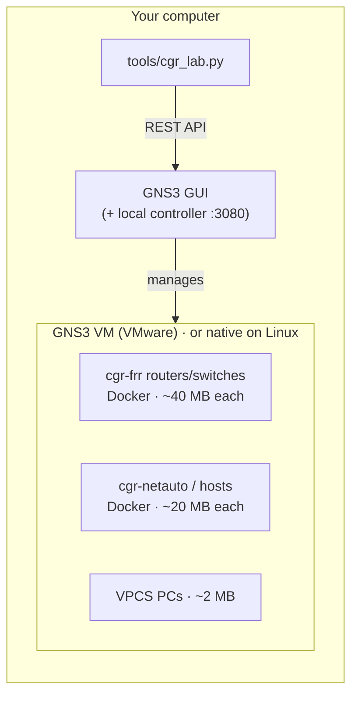
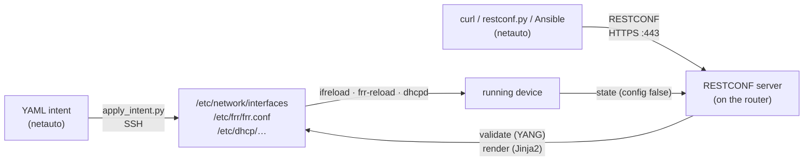

# How the lab environment works

* **GNS3 GUI** draws the topology and opens consoles. It talks to a small local *controller*.
* **GNS3 VM** (Windows/macOS) is a small Linux VM where the devices actually run as Docker
  containers. On Linux, they run directly on your machine.
* **`tools/cgr_lab.py`** builds a lab from `labs/<lab>/topology.yml` through the same REST API
  the GUI uses, so you never have to drag 15 devices and 40 cables by hand.

## The devices

| Node | What it is | Configure with |
|---|---|---|
| **Router / switch** (`cgr-frr`) | Debian + FRRouting + ifupdown2 + Linux bridge/bonding + ISC DHCP server/relay + a RESTCONF server. Ports `swp1…swpN`, management `eth0` | `/etc/network/interfaces` + `ifreload -a`; `vtysh`; DHCP files; or RESTCONF / YAML intent |
| **netauto** (`cgr-netauto`) | Python, PyYAML, Jinja2, yangson, pyang, paramiko, Ansible, curl, jq | the tools in `/root/cgr` |
| **Linux host** (same image as netauto) | a "PC/server" with a real Linux shell and a DHCP client; data port `eth1` | `ip addr`, `ip route`, `dhclient` |
| **VPCS** | GNS3's built-in tiny PC | `ip 10.0.0.1/24 10.0.0.254` |

Why this design:
* **Same for everyone** — the images are multi-architecture (Intel/AMD and Apple Silicon), so
  every student runs exactly the same software.
* **Light** — no virtual machines per device and no nested virtualisation; a 15-node lab needs
  < 1 GB of RAM, so a GNS3 VM with 2 GB is enough.
* **Real tools** — FRRouting is the routing suite inside Cumulus Linux, SONiC and many others;
  ifupdown2 is the interface manager written by Cumulus Networks; Linux bridges and bonds are
  what those switches use underneath.

Every lab has an **out-of-band management network** (switch `mgmt-sw`) connecting each
router/switch `eth0` and the netauto station. Labs 00 and 03 use `192.168.100.0/24`
(netauto = `.10`); labs 01, 02 and 04 use `192.168.200.0/24` (netauto = `.254`). The netauto
station always has the list of the current lab's devices in `/root/lab/inventory.yml`.

## The model-driven layer

Both paths use the same YANG module (`cgr-device`), the same validation and the same
templates, and they share the device's datastore (`/etc/cgr/running.json`).
