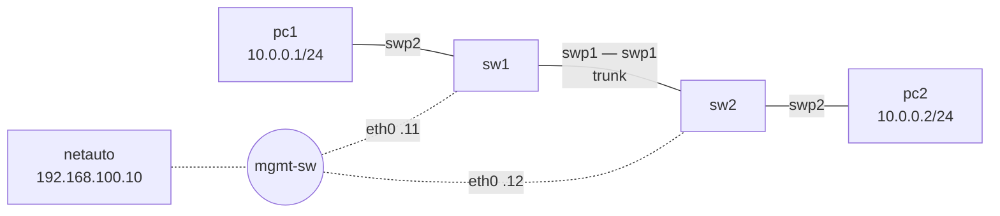

# Lab 00 — First contact (setup check)

**Goal:** prove that your installation works end to end: the lab builds and starts, the
management network works, a VLAN carries traffic between two PCs, and you can configure a
switch from the automation station — with a YAML file over SSH and with RESTCONF. Do this lab in the first class**.



## 1. Build and start

```bash
python tools/cgr_lab.py build labs/lab00-first-contact --start
```

In GNS3: **File → Open project → lab00-first-contact**. The first start downloads the images
(a few minutes). Double-click a node to open its console.

## 2. Look around

On **sw1**:

```bash
ip -br link            # eth0 = management, swp1..swp7 = switch ports
cat /etc/network/interfaces
vtysh -c "show version"
```

On **netauto**:

```bash
ping -c2 192.168.100.11
ssh cgr@192.168.100.12          # password: cgrlab   (exit to come back)
```

## 3. A VLAN across two switches (by hand)

On **sw1**, add to the end of `/etc/network/interfaces` (`nano /etc/network/interfaces`):

```
auto swp1
iface swp1
    bridge-vids 10

auto swp2
iface swp2
    bridge-access 10

auto bridge
iface bridge
    bridge-vlan-aware yes
    bridge-ports swp1 swp2
    bridge-vids 10
```

Apply and check:

```bash
ifreload -a
bridge vlan show
bridge fdb show br bridge | grep -v permanent
```

Do **not** configure sw2 yet. On **pc1**: `ping 10.0.0.2` — it fails. Why?

## 4. The same thing from the automation station

On **netauto**:

```bash
cd /root/cgr
cat intent/lab00.yml
./apply_intent.py intent/lab00.yml --dry-run        # the configuration it generates
./apply_intent.py intent/lab00.yml --diff           # what would change on sw1 and sw2
./apply_intent.py intent/lab00.yml                  # push it
./apply_intent.py intent/lab00.yml --diff           # nothing left to change
```

Now `pc1> ping 10.0.0.2` works. Collect the result:

```bash
./collect.py all -c "bridge vlan show"
```

Your hand-made sw1 configuration was a subset of the intent, so the push only added to it. Now
add `mtu 9000` under `iface swp2` on sw1 (`ifreload -a`) and run `--diff` and a push again: the
push is **refused**, because it would delete a setting you typed by hand. Read the message, then
decide: `./apply_intent.py intent/lab00.yml --force` (drop it) — or keep it by hand and leave sw1
out of the intent. See [toolkit, section 3a](../../automation/README.md#3a-cli-and-automation-on-the-same-lab).

## 5. RESTCONF

Every switch runs a RESTCONF server (HTTPS, user `cgr`, password `cgrlab`) for the YANG module
`cgr-device`. Still on **netauto**:

```bash
pyang -f tree yang/cgr-device@2026-09-15.yang | head -30     # the data model
curl -sk -u cgr:cgrlab https://192.168.100.11/restconf | jq
curl -sk -u cgr:cgrlab "https://192.168.100.11/restconf/data/cgr-device:device?content=config" | jq
curl -sk -u cgr:cgrlab "https://192.168.100.11/restconf/data/cgr-device:device/state/interface=swp2" | jq
```

Change the description of sw1's port swp2 with a PATCH:

```bash
curl -sk -u cgr:cgrlab -X PATCH \
  -H "Content-Type: application/yang-data+json" \
  -d '{"cgr-device:interface": [{"name": "swp2", "description": "PC one"}]}' \
  "https://192.168.100.11/restconf/data/cgr-device:device/interface=swp2" -w "%{http_code}\n"
```

and check it on sw1 (`grep -A2 "iface swp2" /etc/network/interfaces`, `ip -d link show swp2 | grep alias`).
Now try to break it — the server validates every change against the YANG model:

```bash
./restconf.py -v sw1 put interface=swp3 '{"cgr-device:interface": [{"name": "swp3", "mode": "access"}]}'
```

What does the error say, and which statement of the YANG module causes it?

## Checklist (show this to your instructor)

- [ ] `pc1> ping 10.0.0.2` works
- [ ] `./apply_intent.py intent/lab00.yml --diff` reports no changes
- [ ] You can explain what `--diff` compared and why the second push changed nothing
- [ ] Your RESTCONF PATCH returned 204 and the new description is on sw1
- [ ] You can explain the error of the invalid PUT
