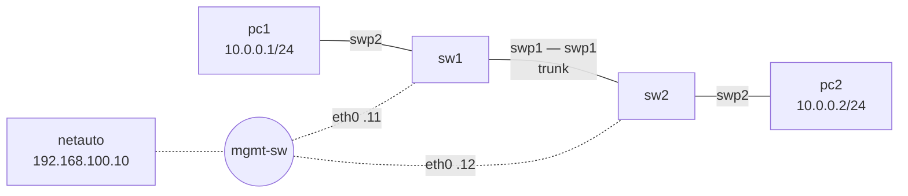

# Lab 00 — First contact (setup check)

**Goal:** prove that your installation works end to end: the lab builds and starts, the
management network works, a VLAN carries traffic between two PCs, and you can configure a
switch from the automation station. Do this lab **before the first class**.



## 1. Build and start

```bash
python tools/cgr_lab.py build labs/lab00-first-contact --start
```

In GNS3: **File → Open project → lab00-first-contact**. The first start downloads the images
(a few minutes). Double-click a node to open its console.

## 2. Look around

On **sw1**:

```bash
ip -br link            # eth0 = management, swp1..swp7 = switch ports
cat /etc/network/interfaces
vtysh -c "show version"
```

On **netauto**:

```bash
ping -c2 192.168.100.11
ssh cgr@192.168.100.12          # password: cgr   (exit to come back)
```

## 3. A VLAN across two switches (by hand)

On **sw1**, add to the end of `/etc/network/interfaces` (`nano /etc/network/interfaces`):

```
auto swp1
iface swp1
    bridge-vids 10

auto swp2
iface swp2
    bridge-access 10

auto bridge
iface bridge
    bridge-vlan-aware yes
    bridge-ports swp1 swp2
    bridge-vids 10
```

Apply and check:

```bash
ifreload -a
bridge vlan show
bridge fdb show br bridge | grep -v permanent
```

Do **not** configure sw2 yet. On **pc1**: `ping 10.0.0.2` — it fails. Why?

## 4. The same thing from the automation station

On **netauto**:

```bash
cd /root/cgr
cat intent/lab00.yml
./apply_intent.py intent/lab00.yml --dry-run        # the configuration it generates
./apply_intent.py intent/lab00.yml --diff           # what would change on sw1 and sw2
./apply_intent.py intent/lab00.yml                  # push it
./apply_intent.py intent/lab00.yml --diff           # nothing left to change
```

Now `pc1> ping 10.0.0.2` works. Collect the result:

```bash
./collect.py all -c "bridge vlan show"
```

## Checklist (show this to your instructor)

- [ ] `pc1> ping 10.0.0.2` works
- [ ] `./apply_intent.py intent/lab00.yml --diff` reports no changes
- [ ] You can explain what `--diff` compared and why the second push changed nothing
