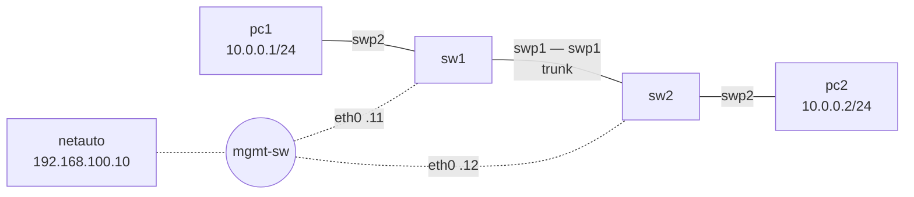

# Lab 00 — First contact (setup check)

**Goal:** prove that your GNS3 installation works end to end: Cumulus VX boots, the
management network works, a VLAN carries traffic between two PCs, and you can talk to a
switch through its REST API. Do this lab **before the first class**.

**Resources:** 2 × Cumulus VX (2 GB each) + 2 VPCS + 1 container ≈ 4.5 GB RAM.
Lite version (`--lite`): ≈ 0.3 GB RAM.



| Device | eth0 (mgmt) | Login |
|---|---|---|
| sw1 | 192.168.100.11/24 | cumulus / CumulusLab1! |
| sw2 | 192.168.100.12/24 | cumulus / CumulusLab1! |
| netauto | 192.168.100.10/24 | (console opens a root shell) |

## 1. Build and start

```bash
python tools/cgr_lab.py build labs/lab00-first-contact --start
python tools/cgr_lab.py bootstrap lab00-first-contact     # wait ~3 min after start
```

In GNS3: **File → Open project → lab00-first-contact**. Double-click a device to open its console.

> No automatic bootstrap? Open the sw1 console, log in as `cumulus` / `cumulus`, set the new
> password to `CumulusLab1!` and paste the lines from `bootstrap/sw1.txt`. Same for sw2.

## 2. Management network

On the **netauto** console:

```bash
ping -c2 192.168.100.11
ping -c2 192.168.100.12
ssh cumulus@192.168.100.11        # password CumulusLab1!
```

## 3. A VLAN across two switches (CLI)

On **sw1** (then repeat on sw2 — same commands):

```bash
nv set bridge domain br_default vlan 10
nv set interface swp1 bridge domain br_default vlan 10       # trunk to the other switch
nv set interface swp2 bridge domain br_default access 10     # port to the PC
nv config diff                                               # what will change?
nv config apply -y
nv show bridge domain br_default vlan
```

The PCs already have their addresses (see `show ip` in the VPCS console). On **pc1**:

```
ping 10.0.0.2
```

## 4. The same switch over the REST API

On **netauto**:

```bash
cd /root/cgr
./nvue.py show sw1 /bridge/domain/br_default
./nvue.py show sw1 /interface/swp2
./curl_examples.sh sw1
```

Now undo the CLI work on sw2 (`nv unset interface swp2 bridge domain br_default` then `nv config apply -y`),
check that the ping fails, and put it back **through the API**:

```bash
./apply_intent.py intent/lab00.yml --dry-run -d sw2    # read the JSON first
./apply_intent.py intent/lab00.yml -d sw2
```

## Checklist (show this to your instructor)

- [ ] `pc1> ping 10.0.0.2` works
- [ ] `./nvue.py show sw2 /interface/swp2` shows `access: 10`
- [ ] You can explain the four REST calls printed by `curl_examples.sh`

## Lite version

```bash
python tools/cgr_lab.py build labs/lab00-first-contact --lite --start
```

sw1/sw2 are then FRR containers with Cumulus-style port names. Configure them the
"classic Cumulus" way: `nano /etc/network/interfaces` (see below), then `ifreload -a`.
Automation uses SSH instead of NVUE: `./apply_intent.py intent/lab00.yml --lite`.

```
auto swp1
iface swp1
    bridge-vids 10

auto swp2
iface swp2
    bridge-access 10

auto bridge
iface bridge
    bridge-vlan-aware yes
    bridge-ports swp1 swp2
    bridge-vids 10
```
