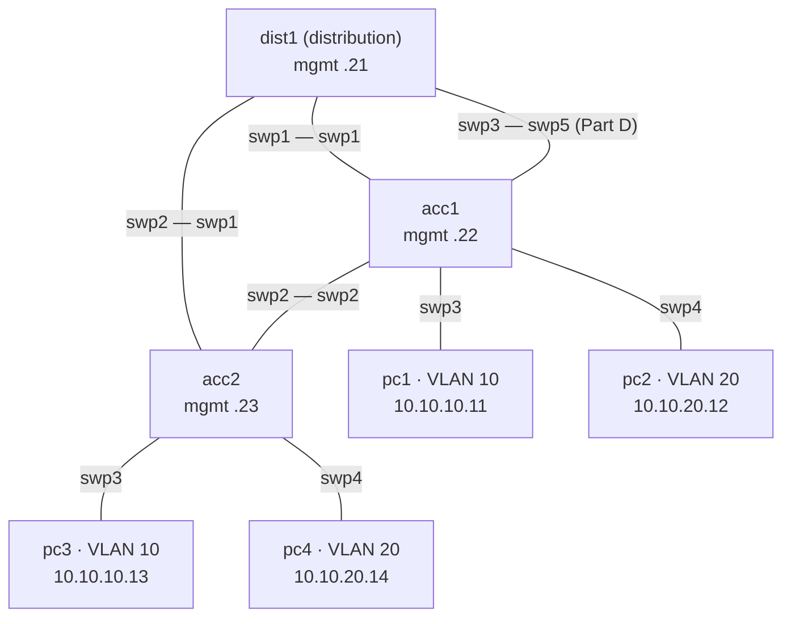

# Lab 01 — Campus switching

**Topics:** VLANs, access/trunk ports, Spanning Tree, inter-VLAN routing (SVIs), LACP bonds,
and describing all of it as YAML intent.

**Nodes:** 3 switches, 4 PCs, netauto. Syntax: [cheat sheet](../CHEATSHEET.md).



| VLAN | Name | Subnet | Gateway (dist1 SVI) |
|---|---|---|---|
| 10 | STAFF | 10.10.10.0/24 | 10.10.10.1 |
| 20 | STUDENTS | 10.10.20.0/24 | 10.10.20.1 |

Management: dist1 192.168.100.21, acc1 .22, acc2 .23, netauto .10 (all /24).

```bash
python tools/cgr_lab.py build labs/lab01-campus-switching --start
```

## Part A — VLANs and trunks

1. On all three switches create a VLAN-aware bridge carrying VLANs 10 and 20.
2. Make the PC ports **access** ports in the right VLAN (see the diagram).
3. Make every switch-to-switch link a **trunk** carrying VLANs 10 and 20
   (leave acc1 swp5 / dist1 swp3 unconfigured until Part D).
4. Verify: `pc1> ping 10.10.10.13` works; `pc1> ping 10.10.20.12` does **not** (why?).

```
auto swp3
iface swp3
    bridge-access 10

auto swp1
iface swp1
    bridge-vids 10 20

auto bridge
iface bridge
    bridge-vlan-aware yes
    bridge-ports swp1 swp2 swp3 swp4
    bridge-vids 10 20
```
`ifreload -a`, then check with `bridge vlan show` and `bridge fdb show br bridge`.

## Part B — Spanning Tree

There is a loop: dist1–acc1–acc2. Enable STP on the three bridges (`bridge-stp on`).

1. Find the root bridge and the blocked port: `bridge link` (port states),
   `ip -d link show bridge` (`root_id`, `bridge_id`, `root_port`).
2. Make **dist1** the root: `bridge-bridgeprio 4096` under `iface bridge`. Which port is blocked now? Why?
3. Shut the acc1–dist1 link (`ip link set swp1 down` on acc1) while pc1 pings pc3
   (`ping 10.10.10.13 -t`). How many pings are lost? Bring it back up. Why is it slow?
   (The Linux bridge runs classic 802.1D STP — compare with what you know about RSTP.)

## Part C — Inter-VLAN routing

On **dist1** create SVIs `vlan10` (10.10.10.1/24) and `vlan20` (10.10.20.1/24):

```
auto vlan10
iface vlan10
    address 10.10.10.1/24
    vlan-id 10
    vlan-raw-device bridge
```
Verify `pc1> ping 10.10.20.14`, `pc1> trace 10.10.20.14`, and `ip route` / `vtysh -c "show ip route"` on dist1.

## Part D — LACP bond

Replace the single acc1–dist1 uplink with a bond `bond1` made of acc1 swp1+swp5 and
dist1 swp1+swp3 (trunk, VLANs 10,20):

```
auto bond1
iface bond1
    bond-slaves swp1 swp5
    bond-mode 802.3ad
    bond-lacp-rate fast
    bridge-vids 10 20
```
Remove the old `swp1` stanza and put `bond1` instead of `swp1` in `bridge-ports`. Verify with
`cat /proc/net/bonding/bond1` (both members, same aggregator ID) and by shutting one member.

## Part E — The same network as intent

On **netauto**, create `intent/lab01.yml` describing acc1, acc2 and dist1 (VLANs, access,
trunks, SVIs — see `intent/lab00.yml` and `schema/intent.schema.yml`). Then:

```bash
./apply_intent.py intent/lab01.yml --dry-run
./collect.py all                            # backup before
./apply_intent.py intent/lab01.yml
```

*Challenge:* the intent model has no bonds or STP priority. Extend `schema/intent.schema.yml`
and `templates/frr_interfaces.j2` to support `stp_priority` and `bonds`, and check the result with
`--dry-run` before pushing.

## Deliverables

Diagram with root bridge and blocked ports (before/after Part B), the configuration of each
switch (`./collect.py all`), your `intent/lab01.yml`, and answers to the questions in Parts A–B.
