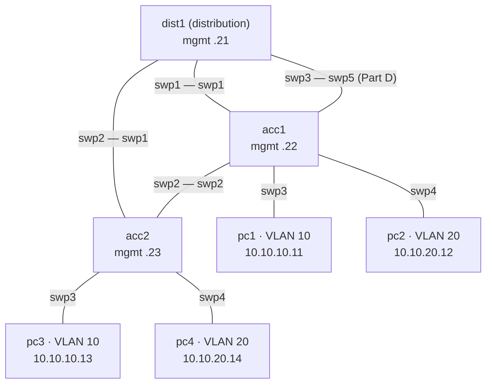

# Lab 01 — Campus switching

**Topics:** VLANs, access/trunk ports, Spanning Tree, inter-VLAN routing (SVIs), LACP bonds,
and describing all of it as YAML intent.

**Resources:** 3 × Cumulus VX (6 GB) + 4 VPCS + netauto. Lite: < 0.5 GB.



| VLAN | Name | Subnet | Gateway (dist1 SVI) |
|---|---|---|---|
| 10 | STAFF | 10.10.10.0/24 | 10.10.10.1 |
| 20 | STUDENTS | 10.10.20.0/24 | 10.10.20.1 |

Management: dist1 192.168.100.21, acc1 .22, acc2 .23, netauto .10 (all /24).

```bash
python tools/cgr_lab.py build labs/lab01-campus-switching --start
python tools/cgr_lab.py bootstrap lab01-campus-switching
```

## Part A — VLANs and trunks

1. On all three switches create VLANs 10 and 20 in `br_default`.
2. Make the PC ports **access** ports in the right VLAN (see the diagram).
3. Make every switch-to-switch link a **trunk** carrying VLANs 10 and 20
   (leave swp5/swp3 between acc1 and dist1 unconfigured until Part D).
4. Verify: `pc1> ping 10.10.10.13` works; `pc1> ping 10.10.20.12` does **not** (why?).

Useful commands: `nv set bridge domain br_default vlan 10,20`,
`nv set interface swpX bridge domain br_default access 10`,
`nv set interface swpX bridge domain br_default vlan 10,20`,
`nv show bridge domain br_default vlan`, `nv show bridge domain br_default mac-table`.

## Part B — Spanning Tree

There is a loop: dist1–acc1–acc2. Cumulus runs RSTP on `br_default` by default.

1. Find the root bridge and the blocked port: `nv show bridge domain br_default stp`,
   `nv show interface swp2 bridge domain br_default stp` (or `mstpctl showbridge` / `mstpctl showport bridge`).
2. Make **dist1** the root: `nv set bridge domain br_default stp priority 4096`. Which port is blocked now? Why?
3. Configure the PC ports as edge ports with BPDU guard
   (`... stp admin-edge on`, `... stp bpdu-guard on`).
4. Shut the acc1–dist1 link (`nv set interface swp1 link state down` on acc1) while pc1 pings pc3
   (`ping 10.10.10.13 -t`). How many pings are lost? Bring it back up.

## Part C — Inter-VLAN routing

On **dist1** create SVIs `vlan10` (10.10.10.1/24) and `vlan20` (10.10.20.1/24):
`nv set interface vlan10 ip address 10.10.10.1/24`.
Verify `pc1> ping 10.10.20.14` and `pc1> trace 10.10.20.14`, and `nv show interface vlan10`.

## Part D — LACP bond

Replace the single acc1–dist1 uplink with a bond `bond1` made of acc1 swp1+swp5 and
dist1 swp1+swp3 (trunk, VLANs 10,20):
`nv set interface bond1 bond member swp1,swp5` (and `swp1,swp3` on dist1), then move the trunk
configuration from the swp to the bond. Verify with `nv show interface bond1 bond` and by shutting one member.

## Part E — The same network as intent

On **netauto**, create `intent/lab01.yml` describing acc1, acc2 and dist1 (VLANs, access,
trunks, SVIs — see `intent/lab00.yml` and `schema/intent.schema.yml`). Then:

```bash
./apply_intent.py intent/lab01.yml --dry-run
./nvue.py backup all                        # before
./apply_intent.py intent/lab01.yml
```

*Challenge:* the intent model has no bonds or STP. Extend `schema/intent.schema.yml`,
`apply_intent.py` (`to_nvue`) and `templates/nv_cli.j2` to support `stp_priority` and `bonds`.

## Deliverables

Diagram with root bridge and blocked ports (before/after Part B), `nv config show -o yaml` of
each switch, your `intent/lab01.yml`, and answers to the questions in Parts A–B.

## Lite version

`--lite` replaces the switches by FRR containers. Configure them in
`/etc/network/interfaces` (ifupdown2 — the syntax Cumulus used before NVUE) and run `ifreload -a`:
VLAN-aware `bridge` with `bridge-vids`, `bridge-access` on PC ports, SVIs as `vlan10`
with `vlan-raw-device bridge`, bonds with `bond-slaves`. STP: `mstpd` is not included — use
`bridge link` / `ip -d link show bridge` to observe the kernel STP instead.
