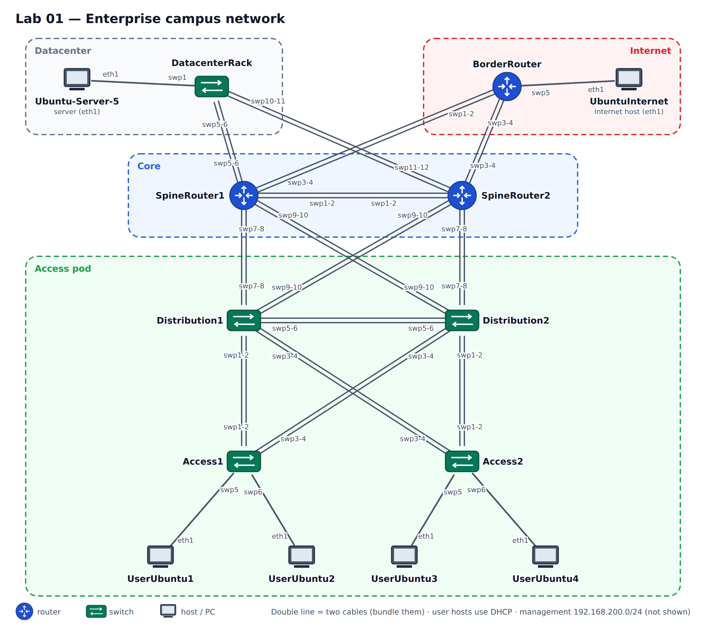

# Lab 01 — Enterprise campus network

**Topics:** VLANs, access and trunk ports, LACP bonds, spanning tree, SVIs and inter-VLAN
routing, DHCP (server and relay), OSPF or IS-IS between the pods, default route,
summarisation, and configuring the network by model-driven automation (YAML / RESTCONF).



## The network

A hierarchical enterprise network. The **access pod** has two access switches (Access1,
Access2) and two distribution switches (Distribution1, Distribution2) — think of the access
network of two buildings of a campus. The distribution switches connect to two core routers
(SpineRouter1, SpineRouter2). The core routers connect to the Internet through **BorderRouter**
and to a datacenter, simulated by a top-of-rack switch (**DatacenterRack**) with one server
(**Ubuntu-Server-5**). **UbuntuInternet** plays the Internet host.

```bash
python tools/cgr_lab.py build labs/lab01-campus --start
```

| Device | Role | Management (eth0) |
|---|---|---|
| Access1, Access2 | access switches | 192.168.200.13, .11 |
| Distribution1, Distribution2 | distribution switches (L2/L3) | 192.168.200.14, .7 |
| SpineRouter1, SpineRouter2 | core routers | 192.168.200.5, .3 |
| BorderRouter | Internet router | 192.168.200.9 |
| DatacenterRack | top-of-rack switch | 192.168.200.12 |
| UserUbuntu1–4 | user hosts, data port **eth1**, address by **DHCP** | — |
| Ubuntu-Server-5, UbuntuInternet | servers, data port **eth1**, static address | — |
| netauto | automation station | 192.168.200.254 |

Cabling (port = port on both ends unless noted):

| From | To |
|---|---|
| Access1 swp1, swp2 | Distribution1 swp1, swp2 |
| Access1 swp3, swp4 | Distribution2 swp3, swp4 |
| Access2 swp1, swp2 | Distribution2 swp1, swp2 |
| Access2 swp3, swp4 | Distribution1 swp3, swp4 |
| Access1 swp5 / swp6 | UserUbuntu1 / UserUbuntu2 |
| Access2 swp5 / swp6 | UserUbuntu3 / UserUbuntu4 |
| Distribution1 swp5, swp6 | Distribution2 swp5, swp6 |
| Distribution1 swp7, swp8 | SpineRouter1 swp7, swp8 |
| Distribution1 swp9, swp10 | SpineRouter2 swp9, swp10 |
| Distribution2 swp7, swp8 | SpineRouter2 swp7, swp8 |
| Distribution2 swp9, swp10 | SpineRouter1 swp9, swp10 |
| SpineRouter1 swp1, swp2 | SpineRouter2 swp1, swp2 |
| BorderRouter swp1, swp2 | SpineRouter1 swp3, swp4 |
| BorderRouter swp3, swp4 | SpineRouter2 swp3, swp4 |
| BorderRouter swp5 | UbuntuInternet |
| DatacenterRack swp5, swp6 | SpineRouter1 swp5, swp6 |
| DatacenterRack swp10, swp11 | SpineRouter2 swp11, swp12 |
| DatacenterRack swp1 | Ubuntu-Server-5 |

## Two access scenarios

Configure **both** variations and deliver the configuration of every device for each. Only the
access and distribution switches differ; the rest of the network can keep the same configuration.

* **Scenario 1 — end-to-end VLANs.** Two access VLANs (**2** and **3**), both with hosts on
  Access1 *and* Access2. The links between access and distribution switches must be layer 2.
* **Scenario 2 — local VLANs.** VLAN 2 exists only on Access1 and VLAN 3 only on Access2.

Tip: build each scenario as its own project so you keep both:
`build labs/lab01-campus --name campus-scenario1` and `… --name campus-scenario2`.

## Requirements

1. Two access switches where the end hosts connect, two user VLANs (2 and 3). User-facing ports
   are access ports of the right VLAN (scenario 1: VLAN 2 and 3 on both access switches;
   scenario 2: VLAN 2 only on Access1, VLAN 3 only on Access2).
2. The links between each access switch and each distribution switch are **bundled** (LACP
   bond — "EtherChannel"), as trunks or as layer-3 links depending on the scenario.
3. Use an addressing scheme based on subnets of **10.8.0.0/16**. Choose contiguous subnets for
   the VLANs of the pod so they can be summarised.
4. The distribution switches hold the **SVIs** (gateways) of the VLANs and route between them.
   In scenario 1 choose sensible **root bridges** for the VLANs.
5. **DHCP:** the user hosts get their addresses by DHCP. Run the DHCP server on the
   **datacenter side** (DatacenterRack or a spine router) and configure **DHCP relay** on the
   switches that hold the SVIs. Check the leases on the server.
6. At least the distribution and core layers work at layer 3 with a link-state IGP:
   **single-area OSPF** (Part A) — and, as an alternative, **IS-IS** (Part B).
7. The distribution switches **summarise** the VLAN subnets of the pod towards the core.
8. BorderRouter injects a **default route**, so that any traffic to unknown destinations goes
   to it. The Internet host must be reachable from all VLANs via that default route.
9. The server in the datacenter must be reachable from both VLANs.

### Part A — OSPF
Single-area OSPF in the distribution/core (and datacenter) part. For the summarisation in a
single area, remember that `area … range` only works on an ABR — decide how to obtain it
(e.g. make the pod a separate area, or summarise redistributed routes).

### Part B — IS-IS instead of OSPF
Replace OSPF by IS-IS (one level-2 domain, or level-1 pods with level-1-2 distribution
switches). Compare the routing tables, the default route and the summarisation with Part A.

### Part C — The same network by automation
Describe **one scenario** of the access pod (Access1, Access2, Distribution1, Distribution2) as
YAML intent (`/root/cgr/intent/campus.yml` on netauto, model: `cgr-device`) and deploy it.
On switches you already configured by CLI, start with an import (`./apply_intent.py
intent/campus.yml --import Access1 Access2 Distribution1 Distribution2`), review the file and its
notes, and continue from there — a push that would delete hand-made settings is refused:

```bash
cd /root/cgr
./apply_intent.py intent/campus.yml --check            # validate against the YANG model
./apply_intent.py intent/campus.yml --diff             # what would change?
./apply_intent.py intent/campus.yml                    # deploy over SSH
./apply_intent.py intent/campus.yml --restconf         # ... or with RESTCONF
./restconf.py Distribution1 get state/route --content nonconfig
```

Then make one change **only with RESTCONF** (e.g. add VLAN 4 with its SVI and DHCP relay on
both distribution switches) and show the HTTP requests (`./restconf.py -v …` or `curl`).

## How to configure

See the **[cheat sheet](../CHEATSHEET.md)** (interfaces, bonds, VLANs, SVIs, DHCP, OSPF, IS-IS)
and the **[automation toolkit](../../automation/README.md)** (YAML intent, RESTCONF).

Example — Access1 in scenario 1 (VLANs 2 and 3, bonds to both distribution switches as trunks):

```
auto bond1
iface bond1
    bond-slaves swp1 swp2
    bond-mode 802.3ad
    bridge-vids 2 3

auto bond2
iface bond2
    bond-slaves swp3 swp4
    bond-mode 802.3ad
    bridge-vids 2 3

auto swp5
iface swp5
    bridge-access 2

auto swp6
iface swp6
    bridge-access 3

auto bridge
iface bridge
    bridge-vlan-aware yes
    bridge-ports bond1 bond2 swp5 swp6
    bridge-vids 2 3
    bridge-stp on
```

Hosts: the user hosts run a DHCP client on eth1 at start-up; to ask again, run
`dhclient -r eth1; dhclient eth1` on the host (VPCS: `ip dhcp`). Servers: `ip addr add … dev eth1`,
`ip route add default via …` (or edit `/etc/network/interfaces` on the host).

## What to deliver

The configuration of every device for scenario 1 and scenario 2 (from netauto:
`./collect.py all -o /root/scenario1`), your intent file for Part C, the RESTCONF requests you
used, and a short explanation of your design choices (addressing, root bridges, summarisation,
where DHCP runs). Hand in the GNS3 project with **File → Export portable project**.
