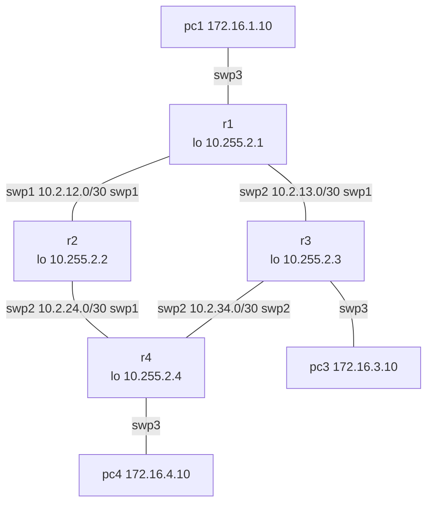

# Lab 02 — OSPFv2

**Topics:** adjacencies, LSDB, single-area and multi-area OSPF, costs and path selection,
stub / totally stubby areas, summarisation at the ABR.

**Nodes:** 4 routers, 3 PCs, netauto. Syntax: [cheat sheet](../CHEATSHEET.md).



| Link / LAN | Subnet | Addresses |
|---|---|---|
| r1–r2 | 10.2.12.0/30 | r1 .1, r2 .2 |
| r1–r3 | 10.2.13.0/30 | r1 .1, r3 .2 |
| r2–r4 | 10.2.24.0/30 | r2 .1, r4 .2 |
| r3–r4 | 10.2.34.0/30 | r3 .1, r4 .2 |
| pc1 LAN (r1 swp3) | 172.16.1.0/24 | r1 .1, pc1 .10 |
| pc3 LAN (r3 swp3) | 172.16.3.0/24 | r3 .1, pc3 .10 |
| pc4 LAN (r4 swp3) | 172.16.4.0/24 | r4 .1, pc4 .10 |
| Loopbacks | 10.255.2.N/32 | rN |

Management: r1 .31, r2 .32, r3 .33, r4 .34 (192.168.100.0/24).

```bash
python tools/cgr_lab.py build labs/lab02-ospf --start
```

### Configuration pattern

Addresses in `/etc/network/interfaces`, then `ifreload -a`:
```
auto lo
iface lo inet loopback
    address 10.255.2.3/32

auto swp1
iface swp1
    address 10.2.13.2/30
```
Routing in `vtysh`:
```
conf t
 router ospf
  ospf router-id 10.255.2.3
 interface swp1
  ip ospf area 0
  ip ospf network point-to-point
 interface lo
  ip ospf area 0
 end
write memory
show ip ospf neighbor
```

## Part A — Single area
Put **everything** in area 0 (links, loopbacks, LANs — make the LAN interfaces passive).
Verify full reachability (`pc1> ping 172.16.4.10`) and explain `show ip ospf database`
(how many router LSAs? any network LSAs? why?).

## Part B — Costs and path selection
1. From pc1, `trace 172.16.4.10`. Which path is used? Why? (`show ip route 172.16.4.0/24`)
2. Change interface costs so that r1 reaches r4's LAN **via r3** (r1→r3→r4).
   (`ip ospf cost 100` under the interface.)
3. What happens to the path when you shut the r3–r4 link?

## Part C — Multi-area
Re-design: **area 0** = r1–r2 link, r1/r2 loopbacks and pc1 LAN. **area 1** = r1–r3, r3–r4,
r2–r4 links, r3/r4 loopbacks and LANs. r1 and r2 are now ABRs.
Look at the LSDB on r1 and on r3: which LSA types appear, and who generates them?

## Part D — Stub areas and summarisation
1. Make area 1 a **stub** area, then **totally stubby**. Compare `show ip route` on r3 each time.
   (`area 1 stub` on every router of area 1; for totally stubby add `area 1 stub no-summary` on the ABRs.)
2. On the ABRs summarise area 1's LANs as one prefix. Which prefix covers 172.16.3.0/24 and
   172.16.4.0/24 but not 172.16.1.0/24? (`area 1 range <prefix>` under `router ospf`.)
   Check the result on r1, r2 and with `pc1> trace 172.16.4.10`.

## Deliverables
Final configs (`./collect.py all` on netauto), LSDB excerpts with your explanation,
traceroutes for Part B.

## Automation corner
`apply_intent.py` supports OSPF (`ospf.router_id`, `ospf.interfaces.<if>.area|network_type|passive`).
Write `intent/lab02.yml` for Part A, check it with `--dry-run` and `--diff`, and push it.
Then use `./collect.py all -c "vtysh -c 'show ip ospf neighbor json'" --json` to verify every
adjacency from a script.
