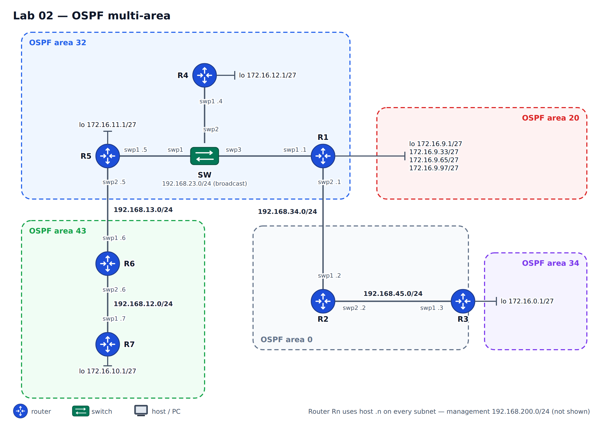

# Lab 02 — OSPF multi-area

**Topics:** multi-area OSPF, area design, summarisation at an ABR, DR/BDR
election on a broadcast segment, default route origination.

You configure the routing between the branches of an enterprise network with OSPF, as in the
figure below.



## Build it

```bash
python tools/cgr_lab.py build labs/lab02-ospf --start
```

## Links

| Link | Ports | Subnet | Area |
|---|---|---|---|
| R5 — SW | R5 **swp1** — SW **swp1** | 192.168.23.0/24 | 32 |
| R4 — SW | R4 **swp1** — SW **swp2** | 192.168.23.0/24 | 32 |
| R1 — SW | R1 **swp1** — SW **swp3** | 192.168.23.0/24 | 32 |
| R1 — R2 | R1 **swp2** — R2 **swp1** | 192.168.34.0/24 | 0 |
| R2 — R3 | R2 **swp2** — R3 **swp1** | 192.168.45.0/24 | 0 |
| R5 — R6 | R5 **swp2** — R6 **swp1** | 192.168.13.0/24 | 43 |
| R6 — R7 | R6 **swp2** — R7 **swp1** | 192.168.12.0/24 | 43 |

Suggested host part: router *Rn* uses `.n` on every subnet (e.g. R1 = 192.168.23.1, R5 = 192.168.23.5).

Loopbacks: R1 Lo0–Lo3 = 172.16.9.1/27, .33/27, .65/27, .97/27 (area 20) ·
R3 172.16.0.1/27 (area 34) · R4 172.16.12.1/27 (area 32) · R5 172.16.11.1/27 (area 32) ·
R7 172.16.10.1/27 (area 43). Management: R1 .31 … R7 .37, SW .30, netauto .254 (192.168.200.0/24).

## Requirements

Implement the following to obtain full connectivity between all addresses of the topology:

1. Configure the interfaces with the addresses of the figure.
2. Configure OSPF with the interfaces in the areas shown in the figure.
3. Configure R1 to **summarise area 20** with the most specific mask possible.
4. The segment R1–R4–R5 is a **broadcast** network with **R1 as the DR**; configure the switch
   (SW) ports as access ports in VLAN 1.
5. Configure R3 to **always originate a default route**.
6. Figure out the **hidden issue** in the topology that you need to address to have full
   connectivity, and fix it.
7. Verify connectivity between all addresses of the topology.

## How to configure

See the **[cheat sheet](../CHEATSHEET.md)**. In short, for R1:

```
# /etc/network/interfaces  (then: ifreload -a)
auto lo
iface lo inet loopback
    address 172.16.9.1/27
    address 172.16.9.33/27
    ...
auto swp1
iface swp1
    address 192.168.23.1/24
```
```
vtysh
conf t
 interface swp1
  ip ospf area 32
  ip ospf network broadcast
  ...
```

The switch **SW** is a lab switch node: a VLAN-aware `bridge` with swp1–3
as `bridge-access 1` ports (see the cheat sheet).

Notes:
* Addresses on `lo` are advertised by OSPF as /32 routes. That does not change the
  summarisation task (the most specific prefix covering the four loopbacks); to advertise them
  as /27, use dummy interfaces (see the note in the cheat sheet).
* Verification from any router: `ping -I <source-address> <destination>`,
  `traceroute -s <source-address> <destination>`.

## What to deliver

The configuration of every router and of SW (`./collect.py all` on netauto), the relevant
`show ip ospf database` / `show ip route` outputs, your explanation of the hidden issue and of
the fix, and the connectivity tests.

## Automation corner

Everything in this lab can be expressed in the `cgr-device` model (look at the `ospf`
container in `pyang -f tree yang/cgr-device@2026-09-15.yang`). Write the intent for R1 and
R5, check it with `./apply_intent.py intent/ospf.yml --diff`, and read the adjacencies back with
`./restconf.py R1 get state/ospf-neighbor --content nonconfig`.
