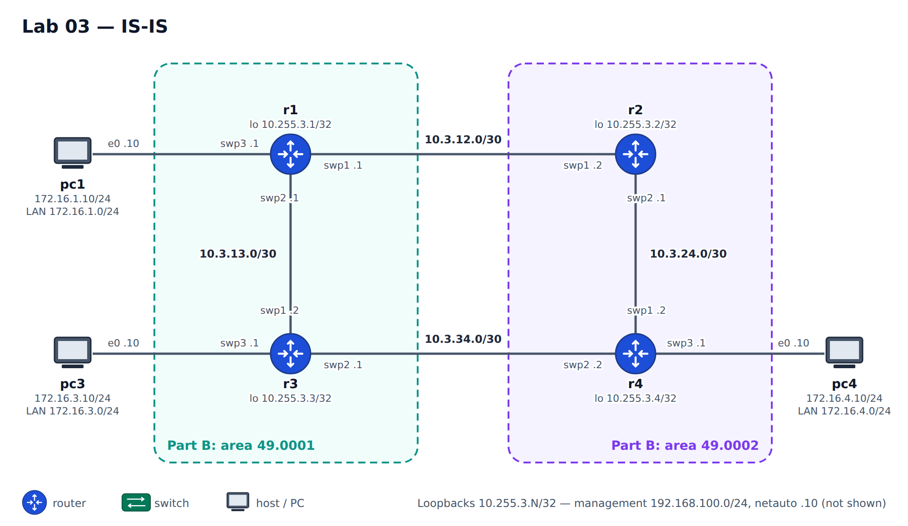

# Lab 03 — IS-IS

**Topics:** NET addresses, Level-1 / Level-2 / Level-1-2 routers, areas, the attached bit,
metrics (wide), comparison with OSPF.

**Nodes:** 4 routers, 3 PCs, netauto. Syntax: [cheat sheet](../CHEATSHEET.md).



| Link / LAN | Subnet | Addresses |
|---|---|---|
| r1–r2 | 10.3.12.0/30 | r1 .1, r2 .2 |
| r1–r3 | 10.3.13.0/30 | r1 .1, r3 .2 |
| r2–r4 | 10.3.24.0/30 | r2 .1, r4 .2 |
| r3–r4 | 10.3.34.0/30 | r3 .1, r4 .2 |
| pc1 LAN (r1 swp3) | 172.16.1.0/24 | r1 .1, pc1 .10 |
| pc3 LAN (r3 swp3) | 172.16.3.0/24 | r3 .1, pc3 .10 |
| pc4 LAN (r4 swp3) | 172.16.4.0/24 | r4 .1, pc4 .10 |
| Loopbacks | 10.255.3.N/32 | rN |

Management: r1 .31 … r4 .34 (192.168.100.0/24), netauto .10.

```bash
python tools/cgr_lab.py build labs/lab03-isis --start
```

### Configuration pattern (vtysh)

```
conf t
 router isis CGR
  net 49.0001.0000.0000.0001.00
  is-type level-2-only
  metric-style wide
 interface lo
  ip router isis CGR
  isis passive
 interface swp1
  ip router isis CGR
  isis network point-to-point
 end
write memory
```
Useful: `show isis neighbor`, `show isis database [detail]`, `show isis route`, `show isis topology`.
If neighbours are *Up* but the LSPs carry no prefixes, run `clear isis neighbor` once.

## Part A — One Level-2 domain
All routers `level-2-only`, all in area 49.0001, NET system-id derived from the loopback
(e.g. 10.255.3.1 → `0102.5500.3001`). Advertise loopbacks and LANs (passive). Check full reachability.

## Part B — Two areas
- r1 and r3 → area **49.0001**; r2 and r4 → area **49.0002**.
- r1, r2: `level-1-2`. r3, r4: `level-1` only.

Questions: does the r3–r4 adjacency come up? Why not? How does r3 reach pc4 now
(`show ip route` — look for the default route and the *attached* bit in r1's L1 LSP)?

## Part C — Fix the backup path
Make r3 and r4 `level-1-2`. What changes for the r3–r4 link? Compare the L1 and L2 databases.

## Part D — Metrics and comparison
1. Make r1 reach pc4 through r3 by changing `isis metric`.
2. Write a short table comparing OSPF (Lab 02) and IS-IS: areas vs levels,
   where area borders sit (on routers vs on links), LSA/LSP types, default route in stub/L1 areas.

## Deliverables
`show running-config` of all routers per part, answers to the questions, the comparison table.

## Automation corner
IS-IS is part of the `cgr-device` model (`isis: {net, is-type, interface: [{name, passive,
network-type, metric}]}`). Write `intent/isis.yml` for Part A, push it with
`./apply_intent.py intent/isis.yml`, then do Part B **only with RESTCONF** — e.g.

```bash
./restconf.py r3 patch isis '{"cgr-device:isis": {"is-type": "level-1", "net": "49.0001.0102.5500.3003.00"}}'
./restconf.py r3 get state/route --content nonconfig
```
