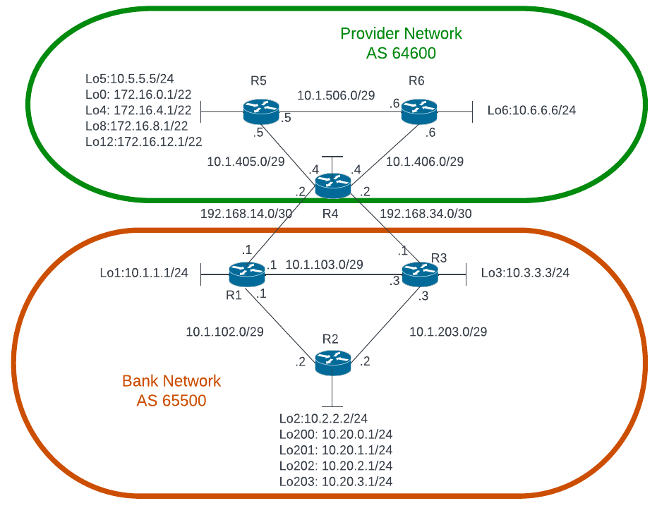

# Lab 04 — BGP: a bank and its provider

**Topics:** OSPF inside each AS, iBGP full mesh, eBGP between ASes, next-hop reachability,
route aggregation, local preference for inbound and outbound traffic selection.



```bash
python tools/cgr_lab.py build labs/lab04-bgp --start
```

## Addressing (use this table — it corrects the figure)

The figure labels three provider links 10.1.**405**.0/29, 10.1.**406**.0/29 and 10.1.**506**.0/29.
Those are not valid IPv4 addresses (an octet cannot be larger than 255). In the lab use
**10.1.45.0/29**, **10.1.46.0/29** and **10.1.56.0/29**, with the same host numbers. The figure
shows no address for R4's loopback: use **10.4.4.4/24**.

| Link | Subnet | Ports | Addresses |
|---|---|---|---|
| R1–R4 (eBGP) | 192.168.14.0/30 | R1 swp1 — R4 swp1 | R1 .1, R4 .2 |
| R3–R4 (eBGP) | 192.168.34.0/30 | R3 swp3 — R4 swp3 | R3 .1, R4 .2 |
| R1–R2 | 10.1.102.0/29 | R1 swp2 — R2 swp2 | R1 .1, R2 .2 |
| R1–R3 | 10.1.103.0/29 | R1 swp3 — R3 swp1 | R1 .1, R3 .3 |
| R2–R3 | 10.1.203.0/29 | R2 swp4 — R3 swp4 | R2 .2, R3 .3 |
| R4–R5 | **10.1.45.0/29** | R4 swp2 — R5 swp2 | R4 .4, R5 .5 |
| R4–R6 | **10.1.46.0/29** | R4 swp4 — R6 swp4 | R4 .4, R6 .6 |
| R5–R6 | **10.1.56.0/29** | R5 swp1 — R6 swp1 | R5 .5, R6 .6 |

| Router | AS | Loopback addresses (all on `lo`) | Management |
|---|---|---|---|
| R1 | 65500 (Bank) | 10.1.1.1/24 | 192.168.200.21 |
| R2 | 65500 | 10.2.2.2/24; 10.20.0.1/24, 10.20.1.1/24, 10.20.2.1/24, 10.20.3.1/24 (Lo200–203) | .22 |
| R3 | 65500 | 10.3.3.3/24 | .23 |
| R4 | 64600 (Provider) | **10.4.4.4/24** | .24 |
| R5 | 64600 | 10.5.5.5/24; 172.16.0.1/22, 172.16.4.1/22, 172.16.8.1/22, 172.16.12.1/22 (Lo0/4/8/12) | .25 |
| R6 | 64600 | 10.6.6.6/24 | .26 |

netauto: 192.168.200.254.

## Requirements

Implement and verify:

1. Use the addressing scheme above.
2. Configure OSPF inside the Bank network with a single area (area 0).
3. Configure OSPF inside the Provider network with a single area (area 0).
4. The Bank network is BGP **AS 65500** and the Provider network is BGP **AS 64600**.
5. **Do not include** the 192.168.14.0/30 and 192.168.34.0/30 networks in the OSPF instances
   of the two ASes.
6. All routers take part in BGP. Configure a **full mesh of iBGP** peers in each AS.
7. In the Bank network, the networks of Lo200–Lo203 on R2 are advertised via BGP **as a
   summary**; these are the only networks the Bank AS advertises via BGP.
8. R5 sends a **summary route** via BGP to the Bank network representing the Lo0, Lo4, Lo8 and
   Lo12 loopbacks; these are the only prefixes the Provider AS announces via BGP.
9. R4 **prefers the path via the R4–R3 link** to reach the Bank network.
10. Routers in the Bank network **prefer the R1–R4 link** to reach the Provider networks.
11. Test connectivity between the BGP-announced networks of R5 and R2
    (`ping -I 10.20.0.1 172.16.4.1` on R2, `traceroute -s …`).

## How to configure

Interfaces and loopbacks in `/etc/network/interfaces` (`ifreload -a`), OSPF and BGP in `vtysh` —
see the **[cheat sheet](../CHEATSHEET.md)**. A few reminders:

```
router bgp 65500
 bgp router-id 10.1.1.1
 neighbor 10.2.2.2 remote-as internal
 neighbor 10.2.2.2 update-source lo
 neighbor 192.168.14.2 remote-as 64600
 address-family ipv4 unicast
  network 10.20.0.0/24
  aggregate-address 10.20.0.0/22 summary-only
  neighbor 10.2.2.2 next-hop-self
  neighbor 192.168.14.2 route-map PREFER-R4 in
!
route-map PREFER-R4 permit 10
 set local-preference 200
```

* `network` only announces a prefix that is **in the routing table** with exactly that mask
  (the loopback subnets are, as connected routes).
* The routers use FRR's *datacenter* defaults: eBGP sessions exchange routes without an
  explicit policy (with *traditional* defaults you would need `no bgp ebgp-requires-policy`).
* Useful: `show bgp summary`, `show bgp ipv4 unicast`, `show bgp ipv4 unicast 10.20.0.0/22`,
  `show ip route bgp`, `show ip ospf neighbor`.

## What to deliver

The configuration of the six routers (`./collect.py all` on netauto), the BGP tables of R1, R4
and R5, the traceroutes of requirement 11, and a short explanation of how you met each
requirement (in particular 7–10, and why next-hop reachability matters for iBGP).

## Automation corner

BGP is part of the `cgr-device` model (`bgp: {asn, router-id, network, aggregate, neighbor:
[{address, remote-as, update-source, next-hop-self, local-preference-in, as-path-prepend-out}]}`).
Configure the Provider AS (R4, R5, R6) **only by automation** — an intent file pushed with
`./apply_intent.py`, or RESTCONF requests with `./restconf.py` / `curl` — and read the BGP
sessions back with `./restconf.py R4 get state/bgp-neighbor --content nonconfig`.
If you already configured R4–R6 by CLI, `./apply_intent.py intent/provider.yml --import R4 R5 R6`
gives you a starting intent file (route-maps other than a single `set local-preference` or an
own-AS prepend are listed as notes).
