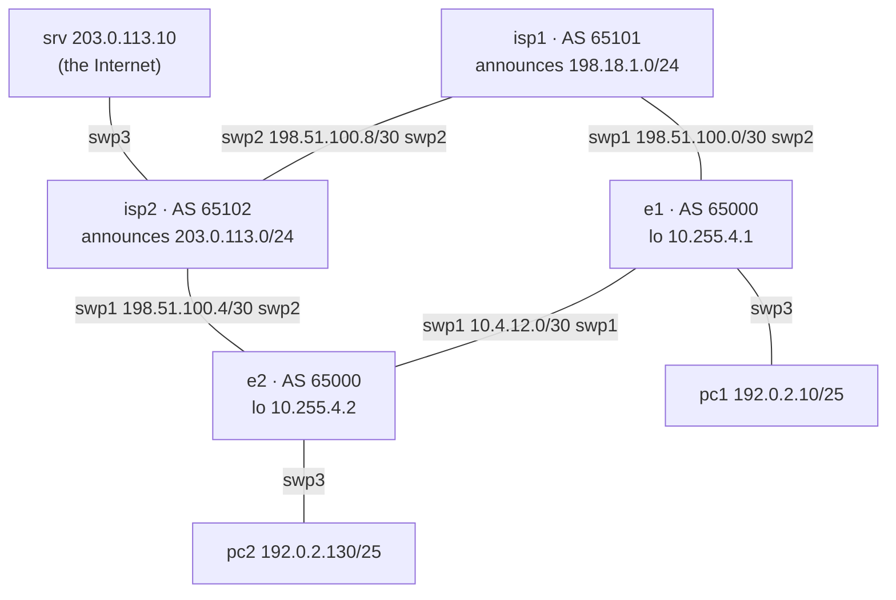

# Lab 04 — BGP: a dual-homed enterprise

**Topics:** eBGP and iBGP sessions, next-hop-self, IGP underlay for iBGP, prefix
advertisement, local preference, AS-path prepending, communities, provider filtering.

**Nodes:** e1, e2 = your enterprise edge routers (AS 65000). isp1 (AS 65101) and isp2
(AS 65102) are **already configured** by the instructor — you may use `show` commands on them,
but do not change them. Syntax: [cheat sheet](../CHEATSHEET.md).



| Link | Subnet | Addresses |
|---|---|---|
| e1–e2 | 10.4.12.0/30 | e1 .1, e2 .2 |
| e1–isp1 | 198.51.100.0/30 | isp1 .1, e1 .2 |
| e2–isp2 | 198.51.100.4/30 | isp2 .5, e2 .6 |
| isp1–isp2 | 198.51.100.8/30 | isp1 .9, isp2 .10 |
| LAN e1 | 192.0.2.0/25 | e1 .1, pc1 .10 |
| LAN e2 | 192.0.2.128/25 | e2 .129, pc2 .130 |
| Internet LAN | 203.0.113.0/24 | isp2 .1, srv .10 |
| Loopbacks | e1 10.255.4.1, e2 10.255.4.2 | |

Your address block is **192.0.2.0/24**. The ISPs accept only 192.0.2.0/24 or more-specifics
up to /25 from you, send you a **default route**, and honour this community:

| Community | Meaning |
|---|---|
| `65101:80` (to isp1) / `65102:80` (to isp2) | "backup link": ISP sets local-preference 80 instead of 200 |

```bash
python tools/cgr_lab.py build labs/lab04-bgp --start
```

## Part A — Underlay
Configure interface addresses on e1/e2 and OSPF area 0 between them (link + loopbacks + LANs as
passive). Check that e1 can ping e2's loopback.

## Part B — eBGP and iBGP
1. On e1 (vtysh): `router bgp 65000`, `bgp router-id 10.255.4.1`, and an eBGP session to
   198.51.100.1 (AS 65101): `neighbor 198.51.100.1 remote-as 65101`. e2: the same towards isp2.
2. iBGP between the loopbacks: `neighbor 10.255.4.2 remote-as internal`,
   `neighbor 10.255.4.2 update-source lo`.
3. Advertise your LANs: `address-family ipv4 unicast` → `network 192.0.2.0/25`.
4. Verify: `show bgp summary`, `show bgp ipv4 unicast`, `show ip route`.
   `pc1> ping 203.0.113.10` must work.
5. On e1, look at the route to 203.0.113.0/24 learned from e2 — is its next hop reachable?
   Fix it with **next-hop-self** (`neighbor 10.255.4.2 next-hop-self` under the address family).

## Part C — Traffic engineering
Company policy: **isp1 is the primary provider** for both directions.

1. *Outbound:* set a higher local preference on routes learned from isp1 (an inbound
   `route-map` with `set local-preference`), so that e2 also exits via e1.
   Verify with `pc2> trace 203.0.113.10`.
2. *Inbound:* make isp2 prefer the path through isp1 to reach 192.0.2.0/24. Try two ways and
   compare on isp2 (`show bgp ipv4 192.0.2.0/24`):
   a) AS-path prepend towards isp2 (`set as-path prepend …`); b) the `65102:80` community
   towards isp2 (`set community …` in an outbound route-map; check that it arrives with
   `show bgp ipv4 unicast 192.0.2.128/25` on isp2).
   Only one of the two methods works here. Which one, and why? (Hint: read isp2's
   `CUSTOMER-IN` route-map with `show route-map` and remember the BGP decision process order.)
3. Advertise the aggregate 192.0.2.0/24 (in addition to or instead of the /25s). What changes?
4. Fail the e1–isp1 link. How long until pc1 reaches srv again? Restore it.

## Deliverables
The configuration of e1/e2 (`./collect.py e1 e2`), `show bgp ipv4 unicast` on isp1 and isp2
before/after Part C, traceroutes, and a short explanation of each policy.

## Automation corner
`automation/intent/lab04-bgp-example.yml` contains e1's intent (underlay + BGP). Complete e2,
then push both with `./apply_intent.py intent/lab04-bgp-example.yml`. Extend the model with
`local_pref` / `prepend` for Part C.
