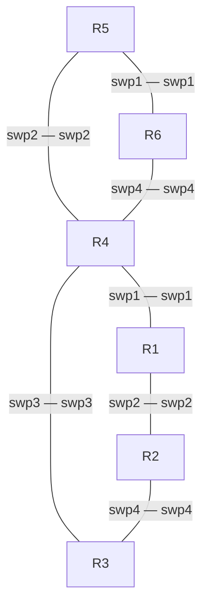

# Project 1 · Part 3 — BGP (GNS3 version of the *BGP* Air simulation)

Same six routers and the same port names as the Air simulation.



```bash
python tools/cgr_lab.py build labs/proj1-bgp --lite --start          # 6 FRR containers, ~0.3 GB
# x86 with ≥ 16 GB RAM: without --lite, then bootstrap
```

Management: R1 192.168.200.21 … R6 192.168.200.26, netauto 192.168.200.254.

Configuration in lite mode: interfaces in `/etc/network/interfaces`, BGP (and any IGP) in
`vtysh` — see **[LITE-CHEATSHEET.md](../LITE-CHEATSHEET.md)**.

> **Tasks:** follow the BGP statement given in class (autonomous systems, addressing and
> policies). *(Instructor: add the statement here.)*
