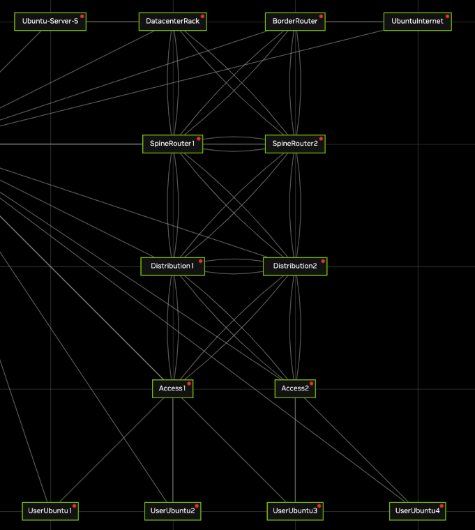

# Project 1 · Part 1 — Enterprise campus network (2025/2026 statement, GNS3 version)

This is the topology of the *ProjectCampusNetwork* simulation used in NVIDIA Air in 2025/2026,
with the **same device names and the same port names**. The tasks (scenarios 1 and 2,
addressing in 10.8.0.0/16, OSPF, bonds, summarisation, default route) are in the project
statement; this page replaces its "Work Setup" section.



## Build it

```bash
python tools/cgr_lab.py build labs/proj1-campus --start
```

8 routers/switches + 6 Linux hosts + netauto, in **< 1 GB of RAM**.

| Device | Kind | Management (eth0) |
|---|---|---|
| Access1, Access2 | switch | 192.168.200.13, .11 |
| Distribution1, Distribution2 | router/switch | 192.168.200.14, .7 |
| SpineRouter1, SpineRouter2 | router | 192.168.200.5, .3 |
| BorderRouter | router | 192.168.200.9 |
| DatacenterRack | switch | 192.168.200.12 |
| UserUbuntu1–4, Ubuntu-Server-5, UbuntuInternet | Linux host (data port **eth1**) | — |
| netauto | automation station | 192.168.200.254 |

Links (identical to Air): Access1 swp1-2 → Distribution1 swp1-2, Access1 swp3-4 → Distribution2 swp3-4,
Access2 swp1-2 → Distribution2 swp1-2, Access2 swp3-4 → Distribution1 swp3-4,
Access1 swp5/swp6 → UserUbuntu1/2, Access2 swp5/swp6 → UserUbuntu3/4,
Distribution1 swp5-6 ↔ Distribution2 swp5-6, Distribution1 swp7-8 → SpineRouter1 swp7-8,
Distribution1 swp9-10 → SpineRouter2 swp9-10, Distribution2 swp7-8 → SpineRouter2 swp7-8,
Distribution2 swp9-10 → SpineRouter1 swp9-10, SpineRouter1 swp1-2 ↔ SpineRouter2 swp1-2,
BorderRouter swp1-2 → SpineRouter1 swp3-4, BorderRouter swp3-4 → SpineRouter2 swp3-4,
BorderRouter swp5 → UbuntuInternet, DatacenterRack swp5-6 → SpineRouter1 swp5-6,
DatacenterRack swp10-11 → SpineRouter2 swp11-12, DatacenterRack swp1 → Ubuntu-Server-5.

## How to configure

See the **[cheat sheet](../CHEATSHEET.md)**:

* VLANs, access ports, trunks, bonds, SVIs → `/etc/network/interfaces` + `ifreload -a`
* OSPF, default route, summarisation → `vtysh`
* Hosts → `ip addr add … dev eth1`, `ip route add default via …`

Example — Access1 in scenario 1 (VLANs 2 and 3, bond to Distribution1 as a trunk):

```
auto bond1
iface bond1
    bond-slaves swp1 swp2
    bond-mode 802.3ad
    bridge-vids 2 3

auto swp5
iface swp5
    bridge-access 2

auto swp6
iface swp6
    bridge-access 3

auto bridge
iface bridge
    bridge-vlan-aware yes
    bridge-ports bond1 bond2 swp5 swp6
    bridge-vids 2 3
    bridge-stp on
```
(`bond2` = swp3+swp4 towards Distribution2, defined the same way.)

## What to deliver

The configuration of every device for scenario 1 and scenario 2: per device,
`/etc/network/interfaces` and the FRR running configuration. From netauto:

```bash
cd /root/cgr
./collect.py all -o /root/scenario1          # one text file per device
```

Then hand in the GNS3 project (**File → Export portable project**): it contains the whole
topology and every node's saved files, including `/root/scenario1` on netauto. Document the
host configuration (`ip addr`, `ip route` on the Ubuntu nodes) too.

## Scenario switching tip

Build each scenario as its own project so you keep both:
`build labs/proj1-campus --name proj1-scenario1` and `… --name proj1-scenario2`.
