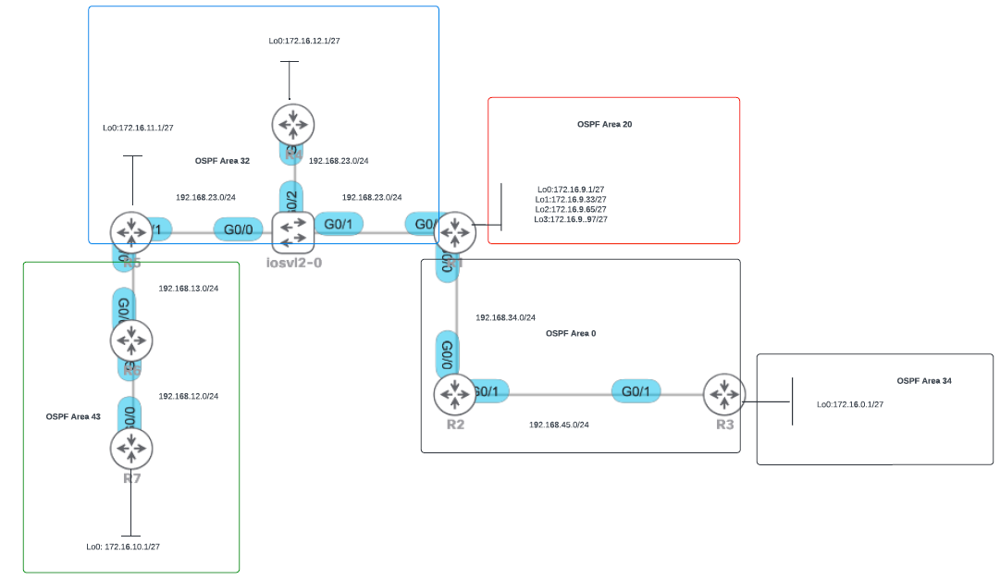

# Project 1 · Part 2 — OSPF multi-area (2025/2026 statement, GNS3 version)

Topology of the statement figure, with the lab's port names. The tasks are the ones in the
statement (addresses and areas as in the figure, summarise area 20 on R1, broadcast segment
R1–R4–R5 with R1 as DR and the switch ports in access VLAN 1, R3 always originates a default
route, find and fix the hidden issue, verify full connectivity).



## Build it

```bash
python tools/cgr_lab.py build labs/proj1-ospf --start
```

## Port mapping (figure → lab)

| Figure | Lab | Subnet | Area |
|---|---|---|---|
| R5 G0/1 — switch G0/0 | R5 **swp1** — SW **swp1** | 192.168.23.0/24 | 32 |
| R4 G0/? — switch G0/2 | R4 **swp1** — SW **swp2** | 192.168.23.0/24 | 32 |
| R1 G0/? — switch G0/1 | R1 **swp1** — SW **swp3** | 192.168.23.0/24 | 32 |
| R1 G0/0 — R2 G0/0 | R1 **swp2** — R2 **swp1** | 192.168.34.0/24 | 0 |
| R2 G0/1 — R3 G0/1 | R2 **swp2** — R3 **swp1** | 192.168.45.0/24 | 0 |
| R5 G0/0 — R6 G0/0 | R5 **swp2** — R6 **swp1** | 192.168.13.0/24 | 43 |
| R6 G0/0 — R7 G0/0 | R6 **swp2** — R7 **swp1** | 192.168.12.0/24 | 43 |

Suggested host part: router *Rn* uses `.n` on every subnet (e.g. R1 = 192.168.23.1, R5 = 192.168.23.5).

Loopbacks: R1 Lo0–Lo3 = 172.16.9.1/27, .33/27, .65/27, .97/27 (area 20) ·
R3 172.16.0.1/27 (area 34) · R4 172.16.12.1/27 (area 32) · R5 172.16.11.1/27 (area 32) ·
R7 172.16.10.1/27 (area 43). Management: R1 .31 … R7 .37, SW .30, netauto .254 (192.168.200.0/24).

## How to configure

See the **[cheat sheet](../CHEATSHEET.md)**. In short, for R1:

```
# /etc/network/interfaces  (then: ifreload -a)
auto lo
iface lo inet loopback
    address 172.16.9.1/27
    address 172.16.9.33/27
    ...
auto swp1
iface swp1
    address 192.168.23.1/24
```
```
vtysh
conf t
 interface swp1
  ip ospf area 32
  ip ospf network broadcast
  ...
```

The switch **SW** is a lab switch node: a VLAN-aware `bridge` with swp1–3
as `bridge-access 1` ports (see the cheat sheet).

Notes:
* Addresses on `lo` are advertised by OSPF as /32 routes. That does not change the
  summarisation task (the most specific prefix covering the four loopbacks); to advertise them
  as /27 like on the Cisco figure, use dummy interfaces (see the note in the cheat sheet).
* Verification from any router: `ping -I <source-address> <destination>`,
  `traceroute -s <source-address> <destination>`.
